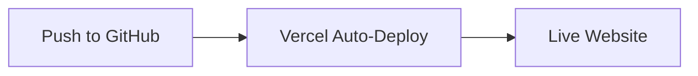
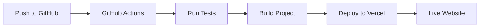

# 🚀 MindsheepLabs Deployment Guide

## Overview
This guide provides multiple automated deployment options for the MindsheepLabs website using Vercel and GitHub integration.

## 🎯 Quick Start (Recommended)

### Option 1: GitHub Integration (Instant Deploy)
**Perfect for: Immediate deployment with zero configuration**

1. **Create GitHub Repository**
   ```bash
   # Push this code to your GitHub repository
   git remote add origin https://github.com/YOUR_USERNAME/mindsheeplabs-website.git
   git push -u origin main
   ```

2. **Connect to Vercel**
   - Go to [vercel.com](https://vercel.com)
   - Sign up with GitHub
   - Click "New Project"
   - Import your GitHub repository
   - Click "Deploy"

3. **Done!** Your site is live at `https://your-project-name.vercel.app`

### Option 2: GitHub Actions (Advanced Automation)
**Perfect for: Custom CI/CD workflows and team collaboration**

1. **Set up GitHub Secrets**
   - Go to your GitHub repository settings
   - Navigate to "Secrets and variables" → "Actions"
   - Add these secrets:
     - `VERCEL_TOKEN` - Your Vercel API token
     - `VERCEL_ORG_ID` - Your Vercel organization ID
     - `VERCEL_PROJECT_ID` - Your Vercel project ID

2. **Get Vercel Credentials**
   ```bash
   # Install Vercel CLI
   npm i -g vercel
   
   # Login and get credentials
   vercel login
   vercel --help
   ```

3. **Automated Workflow**
   - Push to `main` branch → Production deployment
   - Create PR → Preview deployment with comment
   - Automatic builds and tests

## 🔧 Configuration Details

### Environment Variables
Create a `.env.local` file for local development:
```env
# Add any environment variables here
NEXT_PUBLIC_SITE_URL=https://your-domain.com
```

### Build Settings
The project uses these build configurations:
- **Framework**: Next.js 15
- **Build Command**: `npm run build`
- **Output Directory**: `.next`
- **Node Version**: 18.x

### Custom Domain Setup
1. In Vercel dashboard, go to your project
2. Click "Domains"
3. Add your custom domain
4. Follow DNS configuration instructions

## 📋 Deployment Workflows

### Workflow 1: Simple Git Integration


### Workflow 2: GitHub Actions Pipeline


### Workflow 3: Manual CLI Deployment
```bash
# Install dependencies
npm install

# Build the project
npm run build

# Deploy to Vercel
vercel --prod
```

## 🎨 Features Included

### ✅ Production Ready
- Next.js 15 with App Router
- TypeScript for type safety
- Tailwind CSS for styling
- Responsive design
- SEO optimization

### ✅ Performance Optimized
- Automatic image optimization
- Static site generation
- Edge runtime support
- Global CDN distribution

### ✅ Development Experience
- Hot reloading
- TypeScript support
- ESLint configuration
- Automated testing workflow

## 🔍 Monitoring & Analytics

### Vercel Analytics
Enable Vercel Analytics for performance monitoring:
1. Go to your Vercel project dashboard
2. Enable "Analytics"
3. View real-time performance metrics

### Deployment Monitoring
- Automatic deployment status updates
- Build logs and error reporting
- Performance metrics tracking

## 🚨 Troubleshooting

### Common Issues

**Build Failures**
- Check Node.js version (should be 18+)
- Verify all dependencies are installed
- Review build logs in Vercel dashboard

**Domain Issues**
- Ensure DNS records are properly configured
- Check domain propagation status
- Verify SSL certificate installation

**Performance Issues**
- Enable Vercel Analytics
- Check image optimization settings
- Review bundle size analysis

### Support Resources
- [Vercel Documentation](https://vercel.com/docs)
- [Next.js Documentation](https://nextjs.org/docs)
- [GitHub Actions Documentation](https://docs.github.com/en/actions)

## 🎉 Success Metrics

After deployment, you should see:
- ✅ Website live at production URL
- ✅ SSL certificate automatically configured
- ✅ Global CDN distribution active
- ✅ Automatic preview deployments working
- ✅ Performance scores > 90 on Lighthouse

## 🔮 Future Enhancements

### Advanced Features to Consider
- **A/B Testing**: Implement feature flags
- **Analytics**: Add detailed user tracking
- **Monitoring**: Set up error tracking
- **Automation**: Add automated content updates
- **Security**: Implement advanced security headers

---

**Built with ❤️ using [Claude Code](https://claude.ai/code)**